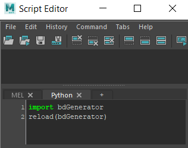
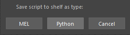
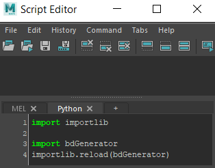
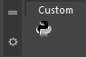
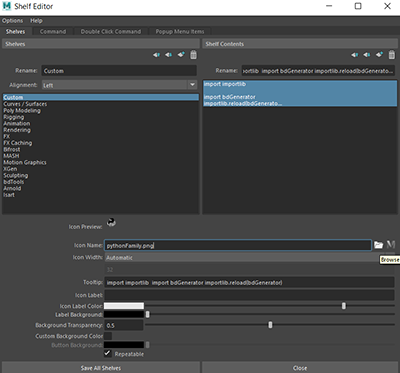
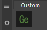

============
Installation
============

.. contents:: Overview
   :depth: 3

| This will cover how to install the bdGenerator script on Maya 2020 and Maya 2022 (With Python 3).

Installation of the script
==========================

| 1- Download `bdGenerator.py`_ and put it into the folder Documents/maya/scripts/

.. _bdGenerator.py: https://raw.githubusercontent.com/benjamin-danneville/bdGenerator/master/bdGenerator.py

--------------------
Maya 2020 (Python 2)
--------------------

| 2- Copy/paste this into your python script editor in Maya

.. code:: python

   import bdGenerator
   reload(bdGenerator) 

| 3- Select everything and drag it with the left mouse button onto your shelf and select python

--------------------
Maya 2022 (Python 3)
--------------------

| 2- Copy/paste this into your python script editor in Maya

.. code:: python

   import importlib

   import bdGenerator
   importlib.reload(bdGenerator) 

| 3- Select everything and drag it with the left mouse button onto your shelf and select python

Adding the icon
===============

| You should now have the basic python icon in the shelf that represents your script

| Now, if you want to have a more fancy icon, download my `bdGenerator Icon`_

.. _bdGenerator Icon: https://raw.githubusercontent.com/benjamin-danneville/bdGenerator/master/logo/bdGenerator.png

| Now to replace the python logo by this one, just right click on the button and hit **edit**
| In the **"Shelves"** tab, click on the Icon Name folder and go find the logo you just downloaded

| Now it should look like this !

| The installation of the script is done