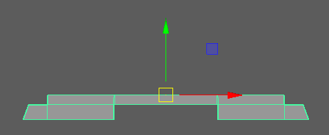
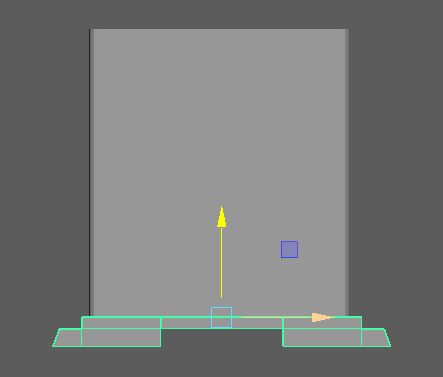

======================
Maya scene requirement
======================

.. contents:: Overview
   :depth: 3

Setup
=====

| The setup is composed of meshes and configurations.
| The meshes correspond to the final 3D models that will replace the blocking.
| The configurations allows you to set 
| how the meshes assembles together to form the final 3D model.
|
| I recommend you two things :
 
- Have the Setup and the Blocking on two different maya folder, 
  so that you can just import the Setup into the blocking scene 
  and then delete it after you've generated you're final scene
 
- Group everything under this organization where ``geoSetup_grp`` contains your Meshes and ``configSetup_grp`` contains your Configuration groups

   .. image:: images/scene_requirement/Setup_Organization.png

------
Meshes
------

- Each mesh has a name easy to identify
- Each pivot has been carefully placed

| **Each mesh has a name easy to identify :**
| We'll use the name of our meshes in our configurations' locator,
| So the easiest it is to identify our mesh, the better
| 
| **Each pivot has been carefully placed :**
| When the script will assembles all the meshes together, 
| it will uses the pivot point to move our mesh

| We'll take the exemple of using bdGenerator for generating random clocks,
| So here you can see all our Meshes

| The emplacement of your meshes in the outliner doesn't matter, 
| but I recommend you to group each variations together.
| For exemple, here we have all the variations of the bottom of a clock 
| inside a group inside ``geoSetup_grp``.  

| Here for instance, the pivot point of each bottom variations is placed at the top,
| so that when bdGenerator will move it, it will "snap" to the bottom of our core mesh

--------------
Configurations
--------------

- Configuration groups only contains locators
- Each locators must have a string attribute named "Variation_obj"

| **Configuration groups only contains locators :**
| It's important because otherwise, the script can not make the difference 
| between a configuration group and a blocking group
| 
| **Each locators must have a string attribute named ``Variation_obj`` :**
| The ``Variation_obj`` attribute will be the emplacement where we will put
| the name of the meshes that the locator can take. It will take a random mesh
| from the list and place at the locator's position.

Purpose of the configurations
-----------------------------

| Having configurations allows you to have differents setup so that you can have controls over
| what you are generating. For exemple if we continue on our clock exemple, 
| we could have a configuration for grounded clocks and walled clocks. 
| But we could go further, if you wanted for instance a circular clock,
| which doesn't need any top variations or even bot variations,
| you could create another configuration group which doesn't have a bot and a top locator.

| Basically, you need a new configuration each time you need to move locators or
| when you want to add or removes locators.

Purpose of the locators
-----------------------

| Locators corresponds to parts of our final object. 
| Continuing with our clocks. You could have a clock with only a body, and a face
| which would correspond to a configuration with two locators, 
| one corresponding to the body, and the other to face

| As you can see, **the easiest way to place our locator is to place it over our meshes**
| 
| Now if we wanted a clock with a body, a face, a top and a bottom, 
| we would need to have 4 locators

The string attributes Variation_obj
-----------------------------------

| As we said, the attribute ``Variation_obj`` makes the link between 
| the locator and the meshes.
| 
| To add it, select the desired locator and go to Modify > Add Attribute.
| Choose **String**, enter the Long name ``Variation_obj`` and you can **Add**

| Now to link this to our meshes, just add the meshes that you want in the attribute like this
| ``Variation_1_geo,Variation_2_geo,Variation_3_geo``
| The meshes must be separated by only a **comma**.
| 
| Now for exemple if we want the top locator to take the top Meshes as variation
| So that when it will generate it will choose between the different top meshes,
| just add the meshes to the top locator's Variation_obj attribute

Blocking
========

- Blocking groups only contains meshes
- Every meshes has a different names
- Blocking groups must be named with ``_grp`` at the end
- Meshes has not been freeze transformed

.. image:: images/scene_requirement/Blocking_Outline.png

| **Blocking groups only contains meshes :**
| It's important because otherwise, the script can not make the difference 
| between a blocking group and a configuration group
| 
| **Blocking groups must be named with ``_grp`` at the end :**
| bdGenerator will use the Blocking groups name to rename the groups that
| will contains the final models assembles from the meshes
|
| **Meshes has not been freeze transformed :**
| The group of meshes that will be created by the script will be placed
| at the position and orientation of the blocking meshes' pivot.
| So if you want the generation to be in the right orientation,
| please don't freeze transform your blocking

