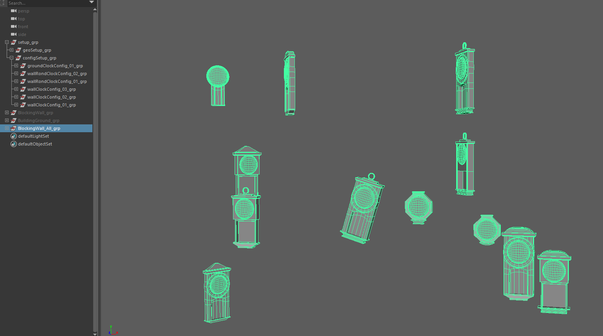

================
Using the script
================

.. contents:: Overview
   :depth: 2

Launching
=========

| Once you're setup has been created and you have you're blocking, you're ready to go.
| If you installed it right, just click on the button

.. image:: images/installation/ShelfbdGeneratorLogo.png

| It should open this

Selection
=========

| Now to use the script, you must select some blocking groups and some configurations groups.
| You can select one or multiple blocking and configuration groups,
| but you don't have to select every blocking and configurations groups. 
| For instance if we continue our clock exemple, you would like to only generate the wall clocks,
| then select your wall clocks blocking group and only your wall clock Configurations

.. image:: images/using_the_script/Selection_Exemple.png

| For more visibility when you generate your final models, hide your blocking groups

Generation
==========

| Now that you have selected your desired blocking and configuration groups,
| Just click on ``Generate`` !

| The script create a group for each blocking groups, they are named using the blocking groups name.
| These group should contains a group for each meshes that were present in the blocking groups 

| If you're not happy with the random seed / generation that you got,
| you can hit on ``Random`` so that it will generate again the last generation

Deleting a seed
===============

| If you want to delete the generation you did in a clean way,
| you just have to delete the groups that bdGenerator created,
| easely identified by the ``_All_grp`` name at the end

